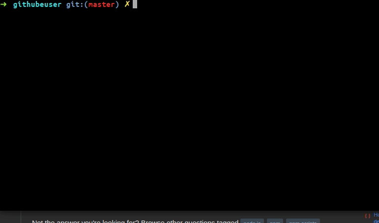

# validate-node-package
This script will help you to find the project's name and version from package.json file!



## How

clone the repo:
```
git clone https://github.com/lifeeric/validate-node-package
```

and make permissions
```
# change dir
cd validate-node-package

chmod +x npmv
```

and make it globally

```
sudo cp npmv /bin
```

### [This Script is for this stackoverflow question](https://stackoverflow.com/questions/62966815/how-to-run-npm-scripts-at-the-global-level-enforce-on-all-node-projects/62977739?noredirect=1#comment111396530_62977739)
